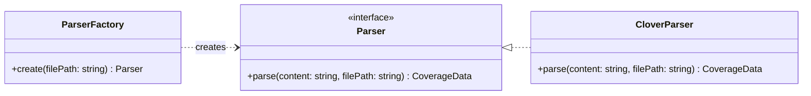
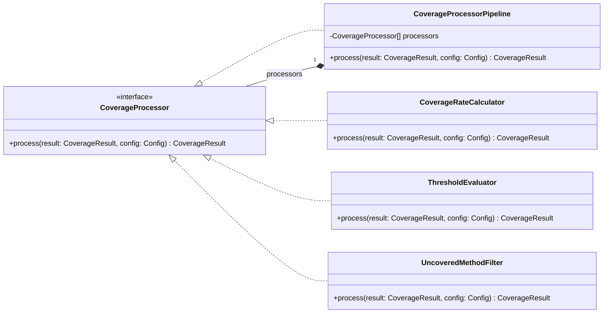
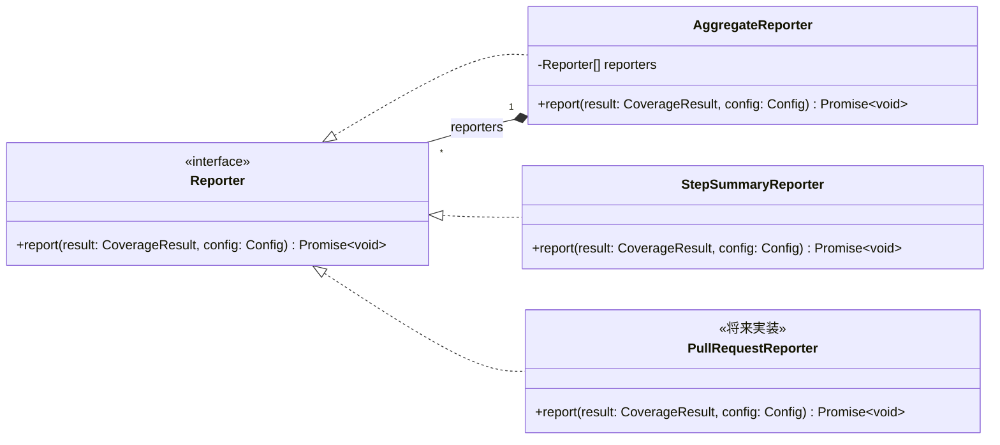
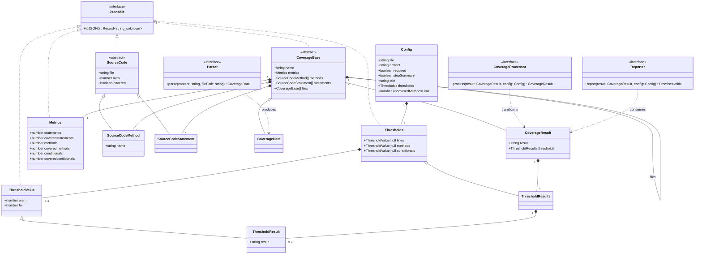

# クラス図

## クラス・インターフェース一覧

### 処理ステップ

| 種別 | 名前 | 役割 |
|---|---|---|
| クラス | `ReportCodeCoverageAction` | アクション全体を表すクラス。`run()` 内で `Config` を生成し、各ステップを順に呼び出す |
| クラス | `SourceResolveProcess` | ステップ 2。artifact ダウンロードと glob を確定し、解決済み glob パスを返す |
| クラス | `CoverageLoadProcess` | ステップ 3。glob でファイルを探索・読み込み、`ParserFactory` 経由でパースして `CoverageData[]` を返す |
| クラス | `CoverageAnalysisProcess` | ステップ 4。`CoverageData[]` を合算し `CoverageProcessorPipeline` で処理して `CoverageResult` を生成する。副作用として outputs を書き込む |
| クラス | `ReportProcess` | ステップ 5。`Config` から `AggregateReporter` を組み立て、`report` を呼び出す |

```mermaid
classDiagram
    direction LR

    class ReportCodeCoverageAction {
        +run() Promise~void~
    }

    class SourceResolveProcess {
        +run(config: Config) Promise~string~
    }

    class CoverageLoadProcess {
        +run(glob: string, config: Config) Promise~CoverageData[]~
    }

    class CoverageAnalysisProcess {
        +run(data: CoverageData[], config: Config) CoverageResult
    }

    class ReportProcess {
        -build(config: Config) AggregateReporter
        +run(result: CoverageResult, config: Config) Promise~void~
    }

    class AggregateReporter {
        -Reporter[] reporters
        +report(result: CoverageResult, config: Config) Promise~void~
    }

    ReportCodeCoverageAction --> SourceResolveProcess : Config
    SourceResolveProcess --> CoverageLoadProcess : glob
    CoverageLoadProcess --> CoverageAnalysisProcess : CoverageData[]
    CoverageAnalysisProcess --> ReportProcess : CoverageResult
    ReportProcess ..> AggregateReporter : builds & calls
```

---

### 設定

| 種別 | 名前 | 役割 |
|---|---|---|
| クラス | `Config` | inputs をパースした設定値の集合 |
| クラス | `Thresholds` | lines / methods / conditionals それぞれの閾値設定を保持する |
| クラス | `ThresholdValue` | 単一メトリクスの warn / fail 閾値ペア |

### データモデル

| 種別 | 名前 | 役割 |
|---|---|---|
| インターフェース | `Jsonable` | `toJSON()` を定義するインターフェース。outputs に含まれるデータクラスが実装する |
| クラス | `Metrics` | statements / methods / conditionals の生カウント値を保持する。`Jsonable` を実装 |
| 抽象クラス | `SourceCode` | `SourceCodeMethod` / `SourceCodeStatement` の親クラス。`file`・`num`・`covered` の共通属性を持つ。`Jsonable` を実装 |
| クラス | `SourceCodeMethod` | メソッドの情報。`SourceCode` を継承し `name` を追加 |
| クラス | `SourceCodeStatement` | ステートメントの情報。`SourceCode` を継承 |
| 抽象クラス | `CoverageBase` | `CoverageData` / `CoverageResult` の親クラス。`name`・`metrics`・`methods`・`statements`・`files` の共通属性を持つ。`Jsonable` を実装 |
| クラス | `CoverageData` | `CoverageBase` を継承。パーサーが出力するパース済みの生データ。`result` / `thresholds` は持たない |
| クラス | `ThresholdValue` | 単一メトリクスの warn / fail 閾値ペア。`Jsonable` を実装 |
| クラス | `ThresholdResult` | `ThresholdValue` を継承し `result`（ok / warn / fail）を追加した閾値判定結果 |
| クラス | `Thresholds` | lines / methods / conditionals それぞれの閾値設定を保持する。`Jsonable` を実装 |
| クラス | `ThresholdResults` | `Thresholds` を継承し、各フィールドの型を `ThresholdResult` に特化したもの |
| クラス | `CoverageResult` | `CoverageBase` を継承。`result` / `thresholds` を追加した最終形。`report` output のシリアライズ対象 |

### パーサー

| 種別 | 名前 | 役割 |
|---|---|---|
| インターフェース | `Parser` | パーサーのインターフェース。`parse(content: string, filePath: string): CoverageData` を定義 |
| クラス | `CloverParser` | `Parser` の実装。Clover XML を `CoverageData` に変換する |
| クラス | `ParserFactory` | ファイルパスまたは内容からフォーマットを判別し、適切な `Parser` インスタンスを返す |

### プロセッサー

| 種別 | 名前 | 役割 |
|---|---|---|
| インターフェース | `CoverageProcessor` | `CoverageResult` に対する処理のインターフェース（Strategy パターン）。`process(result: CoverageResult, config: Config): CoverageResult` を定義 |
| クラス | `CoverageProcessorPipeline` | `CoverageProcessor` の実装。複数の `CoverageProcessor` を保持し順に実行する（Composite パターン） |
| クラス | `CoverageRateCalculator` | `CoverageProcessor` の実装。カバレッジのパーセンテージを計算して `CoverageResult` に付加する |
| クラス | `ThresholdEvaluator` | `CoverageProcessor` の実装。閾値判定を行い `result` / `thresholds` フィールドを設定する |
| クラス | `UncoveredMethodFilter` | `CoverageProcessor` の実装。未カバーメソッドを `uncoveredMethodsLimit` に従いフィルターする |

### レポーター

| 種別 | 名前 | 役割 |
|---|---|---|
| インターフェース | `Reporter` | 出力処理のインターフェース。`report(result: CoverageResult, config: Config): Promise<void>` を定義 |
| クラス | `AggregateReporter` | `Reporter` の実装。複数の `Reporter` を保持し順に実行する（Composite パターン） |
| クラス | `StepSummaryReporter` | `Reporter` の実装。GitHub Step Summary に書き込む |
| クラス | `PullRequestReporter` | `Reporter` の実装（将来実装）。PR コメントに書き込む |

---

## 全体構成

