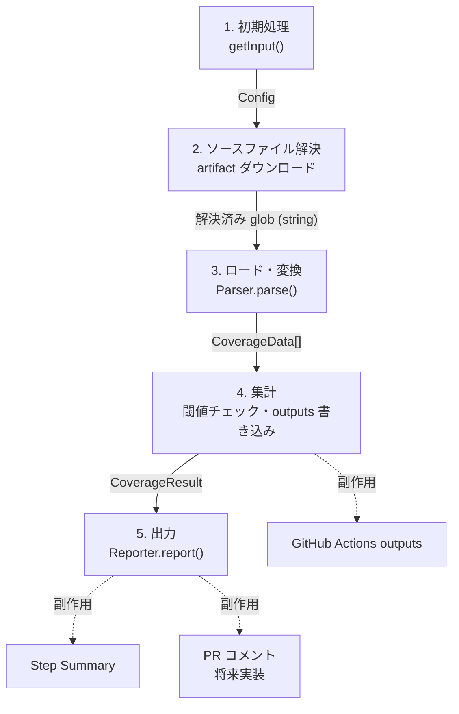

# 処理フロー

```mermaid
flowchart TD
    A["1. 初期処理\ngetInput()"] -->|Config| B
    B["2. ソースファイル解決\nartifact ダウンロード"] -->|"解決済み glob (string)"| C
    C["3. ロード・変換\nParser.parse()"] -->|"CoverageData[]"| D
    D["4. 集計\n閾値チェック・outputs 書き込み"] -->|CoverageResult| E
    E["5. 出力\nReporter.report()"]

    D -.->|副作用| F[GitHub Actions outputs]
    E -.->|副作用| G[Step Summary]
    E -.->|副作用| H[PR コメント\n将来実装]
```
